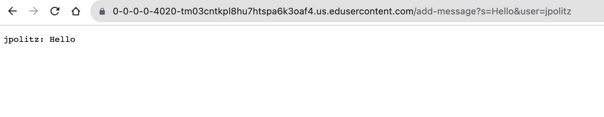
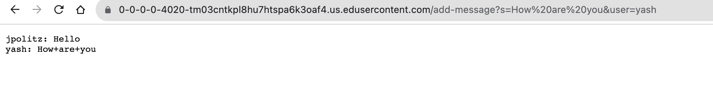
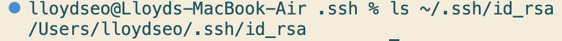
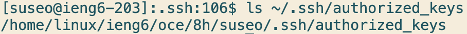

**Part 1:**

ChatServer.java code:
```
import java.io.IOException;
import java.net.URI;
import java.util.ArrayList;

class Handler implements URLHandler {
    // The one bit of state on the server: a number that will be manipulated by
    // various requests.
    ArrayList<String> prompts = new ArrayList<>();

    public String handleRequest(URI url) {
        if (url.getPath().contains("/add-message")) {
            String[] parameters = url.getQuery().split("=");
            if (parameters[0].equals("s")) {
                String[] subParameters = parameters[1].split("&");
                prompts.add(parameters[2] + ": " + subParameters[0]);
                String returnStr = "";
                for (int i = 0; i < prompts.size(); i++) {
                    returnStr += prompts.get(i) + "\n";
                }
                return returnStr;
            }
            else {
                return "404 Not Found!";
            }
        }
        else {
            return "404 Not Found!";
        }
    }
}

class ChatServer {
    public static void main(String[] args) throws IOException {
        if(args.length == 0){
            System.out.println("Missing port number! Try any number between 1024 to 49151");
            return;
        }

        int port = Integer.parseInt(args[0]);

        Server.start(port, new Handler());
    }
}
```
Screenshots: 

Method called: ```handleRequest()```
<br>
Argument: https://0-0-0-0-4020-tm03cntkpl8hu7htspa6k3oaf4.us.edusercontent.com/add-message?s=Hello&user=jpolitz
<br>
Field values: ```prompts``` -> ["jpolitz: Hello"]
<br>
Values changed: The String "jpolitz: Hello" was added to the ArrayList ```prompts```



Method called: ```handleRequest()```
<br>
Argument: https://0-0-0-0-4020-tm03cntkpl8hu7htspa6k3oaf4.us.edusercontent.com/add-message?s=How are you&user=yash
<br>
Field values: ```prompts``` -> ["jpolitz: Hello", "yash: How+are+you"]
<br>
Values changed: The String "yash: How+are+you" was added to the ArrayList ```prompts```

**Part 2:**

Absolute path to private key: 

Absolute path to public key: 
