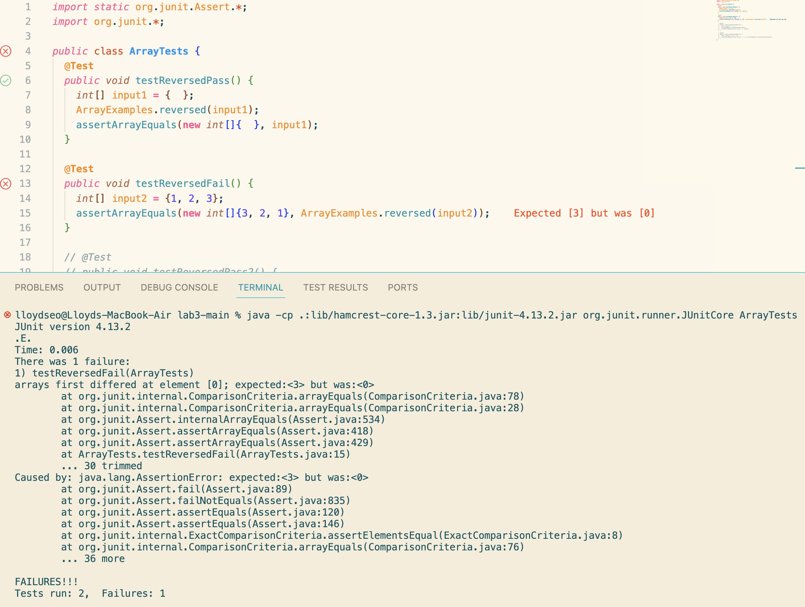

**Part 1 ```reversed(int[] arr)```:**

>Failure-inducing Input:

```
@Test
public void testReversedFail() {
    int[] input = {1, 2, 3};
    assertArrayEquals(new int[]{3, 2, 1}, ArrayExamples.reversed(input));
}
```

>Non failure-inducing Input:

```
@Test 
public void testReversedPass() {
    int[] input = { };
    assertArrayEquals(new int[]{ }, ArrayExamples.reversed(input));
}
```

>Symptoms:



>Bug (Before):

```
static int[] reversed(int[] arr) {
    int[] newArray = new int[arr.length];
    for(int i = 0; i < arr.length; i += 1) {
      arr[i] = newArray[arr.length - i - 1];
    }
    return arr;
}
```

>Bug (After; fixed):

```
static int[] reversed(int[] arr) {
    int[] newArray = new int[arr.length];
    for(int i = 0; i < arr.length; i += 1) {
      newArray[i] = arr[arr.length - i - 1]; //changed
    }
    return newArray; //changed
}
```

This addresses the issue because the bug was that ```newArray``` was not storing the elements of ```arr``` in reversed order as intended. Instead, it was storing it into the parameter ```arr``` and returning ```arr```. The fix assigns the elements of ```arr``` to ```newArray``` in reverse order and returns ```newArray```.

<br>

**Part 2 ```grep```:**

Recursive Search ```-r```:

>Example 1

```
lloydseo@Lloyds-MacBook-Air lab3-main % grep -r "Kevin" technical
technical/government/About_LSC/commission_report.txt:167 (comment of Kevin
technical/government/About_LSC/commission_report.txt:Comments at 168 (comment of Kevin G. Magee, Legal Action of
technical/government/About_LSC/commission_report.txt:Rural Legal Aid, et. al); March Comments at 167 (comment of Kevin
technical/government/About_LSC/commission_report.txt:Services of Oregon); March Comments at 168 (comment of Kevin G.
technical/government/About_LSC/commission_report.txt:months after filing. See March Comments at 168 (comment of Kevin G.
technical/government/About_LSC/commission_report.txt:Kevin G. Magee, Legal Action of Wisconsin); March Comments at
technical/government/About_LSC/commission_report.txt:et. al); March Comments at 168 (comment of Kevin G. Magee, Legal
technical/government/About_LSC/commission_report.txt:Rural Legal Aid, et. al); March Comments at 168 (comment of Kevin
technical/government/Env_Prot_Agen/multi102902.txt:from Kevin Culligan and Mary Jo Krolewski, both of Clean Air
technical/government/Gen_Account_Office/d01121g.txt:Kevin Manson, Instructor, Financial Fraud Institute, Federal Law
technical/government/Media/Free_legal_service.txt:Peoria County State's Attorney Kevin Lyons said all the budget
technical/government/Media/Terrorist_Attack.txt:was Kevin J. Curnin, a senior associate at Stroock & Stroock
technical/plos/journal.pbio.0020101.txt:        Dances with Wolves (the 1990 movie with Kevin Costner) is violent, people
technical/plos/journal.pbio.0020010.txt:        Kevin Guthrie, who found the quickest way through the maze of conflicting advice—much of
technical/biomed/1471-2369-3-10.txt:        Kevin C. Abbott conceived the study, conducted all
technical/biomed/gb-2002-3-12-research0086.txt:          D. virilis (Kevin White, personal
technical/biomed/1471-2334-2-27.txt:          BufferGel was a gift from Dr. Kevin J. Whaley, John
technical/911report/chapter-13.5.txt:            25. Ibid.; see also FBI memo, Kevin G. to Watson, "Protective Services Working Group
technical/911report/chapter-13.2.txt:            149. NEADS audio file, Mission Crew Commander, channel 2, 9:21:50; Kevin Nasypany
technical/911report/chapter-13.2.txt:                cap" between the hijack and Washington, D.C. Kevin Nasypany interview (Jan. 22-23,
technical/911report/chapter-13.2.txt:                position, channel 7, 9:36:34; Kevin Nasypany interview (Jan. 22-23, 2004). For the
technical/911report/chapter-13.2.txt:                Kevin Nasypany interview (Jan. 22-23, 2004).
technical/911report/chapter-13.2.txt:                (NEADS commander); Kevin Nasypany interview (Jan. 22, 2004) (mission commander);
technical/911report/chapter-13.3.txt:                Field Office. See generally Kevin C. interview (Aug. 25, 2003). This created
technical/911report/chapter-13.3.txt:                no-fly list were in U.S. custody as of 9/11. See Kevin G. Hall, Alfonso Chardy, and
```
Function: Recursively searches through ```./technical``` and its subdirectories for the string ```"Kevin"``` in ```.txt``` files and prints out all lines that contain the string. This is useful for finding matched results in a directory and all of its subdirectories.

>Example 2

```
lloydseo@Lloyds-MacBook-Air lab3-main % grep -r "Kevin" technical/government
technical/government/About_LSC/commission_report.txt:167 (comment of Kevin
technical/government/About_LSC/commission_report.txt:Comments at 168 (comment of Kevin G. Magee, Legal Action of
technical/government/About_LSC/commission_report.txt:Rural Legal Aid, et. al); March Comments at 167 (comment of Kevin
technical/government/About_LSC/commission_report.txt:Services of Oregon); March Comments at 168 (comment of Kevin G.
technical/government/About_LSC/commission_report.txt:months after filing. See March Comments at 168 (comment of Kevin G.
technical/government/About_LSC/commission_report.txt:Kevin G. Magee, Legal Action of Wisconsin); March Comments at
technical/government/About_LSC/commission_report.txt:et. al); March Comments at 168 (comment of Kevin G. Magee, Legal
technical/government/About_LSC/commission_report.txt:Rural Legal Aid, et. al); March Comments at 168 (comment of Kevin
technical/government/Env_Prot_Agen/multi102902.txt:from Kevin Culligan and Mary Jo Krolewski, both of Clean Air
technical/government/Gen_Account_Office/d01121g.txt:Kevin Manson, Instructor, Financial Fraud Institute, Federal Law
technical/government/Media/Free_legal_service.txt:Peoria County State's Attorney Kevin Lyons said all the budget
technical/government/Media/Terrorist_Attack.txt:was Kevin J. Curnin, a senior associate at Stroock & Stroock
```
Function: Recursively searches through ```./technical/government``` and its subdirectories for the string ```"Kevin"``` in ```.txt``` files and prints out all lines that contain the string. This is useful for finding matched results in a directory and all of its subdirectories.
<br>

Ignore Case-Sensitivity ```-i```:

>Example 1

```
lloydseo@Lloyds-MacBook-Air lab3-main % grep -i "kevin" technical/government/About_LSC/*.txt
technical/government/About_LSC/commission_report.txt:167 (comment of Kevin
technical/government/About_LSC/commission_report.txt:Comments at 168 (comment of Kevin G. Magee, Legal Action of
technical/government/About_LSC/commission_report.txt:Rural Legal Aid, et. al); March Comments at 167 (comment of Kevin
technical/government/About_LSC/commission_report.txt:Services of Oregon); March Comments at 168 (comment of Kevin G.
technical/government/About_LSC/commission_report.txt:months after filing. See March Comments at 168 (comment of Kevin G.
technical/government/About_LSC/commission_report.txt:Kevin G. Magee, Legal Action of Wisconsin); March Comments at
technical/government/About_LSC/commission_report.txt:et. al); March Comments at 168 (comment of Kevin G. Magee, Legal
technical/government/About_LSC/commission_report.txt:Rural Legal Aid, et. al); March Comments at 168 (comment of Kevin
```
Function: Searches through ```./technical/government/About_LSC``` for the string ```"kevin"``` ignoring case-sensitivity in ```.txt``` files and prints out all lines that contain the string. This is useful for finding all occurrences of a specific string in a file without taking into account case-sensitivity.

>Example 2

```
lloydseo@Lloyds-MacBook-Air lab3-main % grep -i "john" technical/government/About_LSC/*.txt
technical/government/About_LSC/ODonnell_et_al_v_LSCdecision.txt:JOHN EIDLEMAN, Program Specialist for the Legal Services
technical/government/About_LSC/ODonnell_et_al_v_LSCdecision.txt:Corporation; LEGAL SERVICES CORPORATION; JOHN MCKAY, President of
technical/government/About_LSC/ONTARIO_LEGAL_AID_SERIES.txt:Kennedy years and strengthened by President Johnson's vision of a
technical/government/About_LSC/Progress_report.txt:Abrams, John Eidleman, Barb Donnelly, Monica Holmen, Joyce Raby,
technical/government/About_LSC/Progress_report.txt:(aided and abetted by John Meyer and his wonderful staff in
technical/government/About_LSC/Progress_report.txt:it with the support of two terrific Presidents-John McKay and John
technical/government/About_LSC/State_Planning_Report.txt:to justice for all low-income people in Indiana. LSC President John
technical/government/About_LSC/State_Planning_Report.txt:consultant John A. Tull. The study, completed in mid-2000, found
technical/government/About_LSC/State_Planning_Special_Report.txt:Hulett H. Askew John T. Broderick, Jr. John N. Erlenborn Edna
technical/government/About_LSC/State_Planning_Special_Report.txt:John N. Erlenborn, President Victor M. Fortuno, Vice President
technical/government/About_LSC/State_Planning_Special_Report.txt:Program Performance John C. Meyer, Acting Director of Information
technical/government/About_LSC/State_Planning_Special_Report.txt:Justice John T. Broderick and Ernestine Watlington, the Task Force
technical/government/About_LSC/commission_report.txt:Hon. John N. Erlenborn, Chairman Professor T. Alexander
technical/government/About_LSC/commission_report.txt:Douglas S. Eakeley, Chairman Hon. John N. Erlenborn, V
technical/government/About_LSC/commission_report.txt:ice-Chairman Hulett H. Askew LaVeeda M. Battle Hon. John T.
technical/government/About_LSC/commission_report.txt:John McKay, President Danilo A. Cardona, A cting V ice President
technical/government/About_LSC/commission_report.txt:Relations and Public A ffairs John A. Hartingh, Special A ssistant
technical/government/About_LSC/commission_report.txt:to the President John Kennedy, Director of A dministration and
technical/government/About_LSC/commission_report.txt:84 (comment of John W. Morehouse, Wake County Human Services);
technical/government/About_LSC/commission_report.txt:New York); March Comments at 84 (comment of John W. Morehouse, Wake
technical/government/About_LSC/commission_report.txt:Endriss, Attorney at Law); March Comments at 84 (comment of John W.
technical/government/About_LSC/commission_report.txt:Comments at 26263 (comment of John Levy, College of William &
technical/government/About_LSC/commission_report.txt:John N. Erlenborn
technical/government/About_LSC/commission_report.txt:John Erlenborn has been an adjunct professor at Georgetown
```
Function: Searches through ```./technical/government/About_LSC``` for the string ```"john"``` ignoring case-sensitivity in ```.txt``` files and prints out all lines that contain the string. This is useful for finding all occurrences of a specific string in a file without taking into account case-sensitivity.
<br>

Count # of Lines Matched ```-c```:

>Example 1

```
lloydseo@Lloyds-MacBook-Air lab3-main % grep -c "phenotypic" technical/biomed/gb-2003-4-5-r32.txt
7
```
Function: Searches through the file ```./technical/biomed/gb-2003-4-5-r32.txt``` for the string ```"phenotypic"``` and returns the number of lines in the file that contains the string. This is useful when searching for the number of lines in a file that contains a specific string.

>Example 2

```
lloydseo@Lloyds-MacBook-Air lab3-main % grep -c "phenotypic" technical/biomed/gb-2003-4-5-r30.txt
0
```
Function: Searches through the file ```./technical/biomed/gb-2003-4-5-r30.txt``` for the string ```"phenotypic"``` and returns the number of lines in the file that contains the string. This is useful when searching for the number of lines in a file that contains a specific string.
<br>

Display Lines That Don't Contain String ```-v```:

>Example 1

```
lloydseo@Lloyds-MacBook-Air lab3-main % grep -v "," technical/government/media/A_Perk_of_Age.txt 


A Perk of Age: Free Legal Advice
By Kelly Greene
Free Legal advice is only a phone call away - and the hot lines
that provide it are expanding their services.
It's a little known perk available to anyone 60 or older: 21
hot lines for older adults and most take calls from younger
offices and pro bono or reduced-fee private lawyers. Even if you
provide you with referrals to nearby lawyers. The hot lines and
issues.
The U.S. administration on Aging coordinates this loosely knit
legal-services network. Anyone who meets the age requirement can
with the greatest financial or social needs. The federal Agency
recently awarded $2 million in grants to improve elder-law
questionnaires and outreach projects in rural areas and for older
people who don't speak English.
the federal Eldercare Locator at 800-677-1116. If you live in a
assistance.
Another source of low-cost help also expanded this year: AARP's
Legal Services Network is now available in 46 states and expects to
reach all 50 by the end of March. You have to pay the group's dues
($10 a year) to use the services; after that you get 30 minutes of
Lawyers discount their usual rate by 20% after that. Simple wills
cost $75 apiece. You can reach the service at 800-424-3410 or go to
www.aarp.org/LSN to find a lawyer nearby.
```
Function: Searches through the file ```./technical/government/media/A_Perk_of_Age.txt``` for the string ```","``` and returns all lines in the file that do not contain the string. This is useful when searching for all lines in a file that do not contain a specific string.

>Example 2

```
lloydseo@Lloyds-MacBook-Air lab3-main % grep -v "," technical/plos/pmed.0020257.txt            

  
    
      
        
        People living with HIV/AIDS (PLWA) face many forms of stigma and discrimination. This is
        professionals. This can interfere with effective prevention and treatment. Discriminatory
        practices in the health-care sector may also appear to legitimize other forms of
        discrimination against PLWA.
        collaboration with researchers from Policy Project–Nigeria and the Center for the Right to
        Health (also in Nigeria) investigated the problem in Nigeria. With a population of roughly
        has been known about the nature and extent of discrimination against patients with HIV/AIDS
        in Nigeria.
        health-care professionals in 111 health-care facilities in four of Nigeria's 36 states.
        of unknown profession. Fifty-four percent of them worked in public tertiary care
        facilities. Many of the survey's results are worrying. Nine percent of professionals
        patient with HIV/AIDS admission to a hospital. Fifty-nine percent agreed that PLWA should
        appearance. Ninety-one percent agreed that staff should be informed when a patient was
        HIV-positive in order to protect themselves. Forty percent believed health-care
        professionals with HIV/AIDS should not be allowed to work in any area of health-care
        requiring patient contact. Twenty percent agreed that many with HIV/AIDS had behaved
        immorally and deserved their infection. Eight percent felt that treating someone with
        HIV/AIDS was a waste of resources.
        Providers who reported working in facilities that did not always practice universal
        precautions against HIV transmission were more likely to favor restrictive policies towards
        not sufficiently available. Providers who reported less adequate training in HIV/AIDS
        treatment and in ethics were more likely to report negative attitudes towards patients with
        HIV/AIDS. There was no consistent pattern of differences in negative attitudes and
        practices across the different professions surveyed.
        towards patients with HIV/AIDS existed among a significant proportion. Inadequate education
        about HIV/AIDS and a lack of protective and treatment materials appear to favor these
        sampled facilities and health-care professionals may differ significantly from those that
        were not sampled in the study states. Concerns over a perceived lack of privacy in the
        interviews or about job status may have resulted in an underreporting of discriminatory
        behavior and/or an overreporting of “correct” practices or attitudes. The authors note that
        contribute to discriminatory behavior. They call for targeted education of health-care
        introduction and enforcement of anti-discrimination policies.
      
    
  
```
Function: Searches through the file ```./technical/plos/pmed.0020257.txt``` for the string ```","``` and returns all lines in the file that do not contain the string. This is useful when searching for all lines in a file that do not contain a specific string.

Citation (same for all command-line options): ```https://www.digitalocean.com/community/tutorials/grep-command-in-linux-unix```
