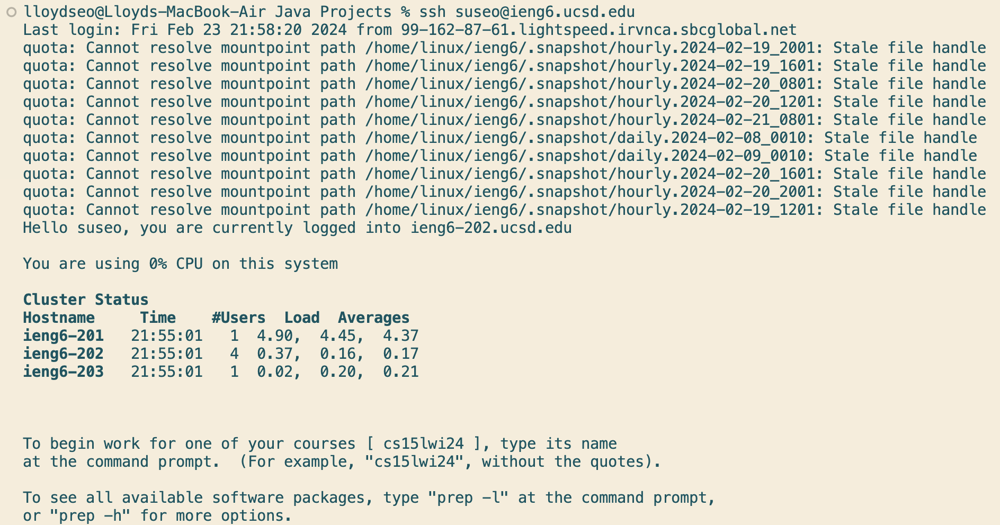
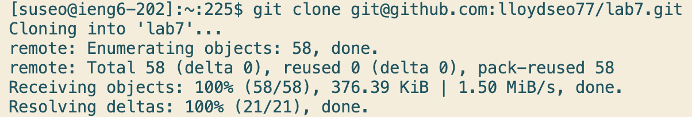
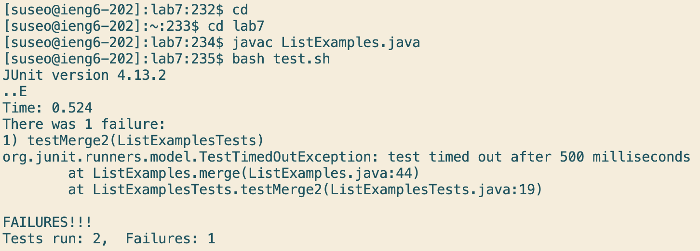
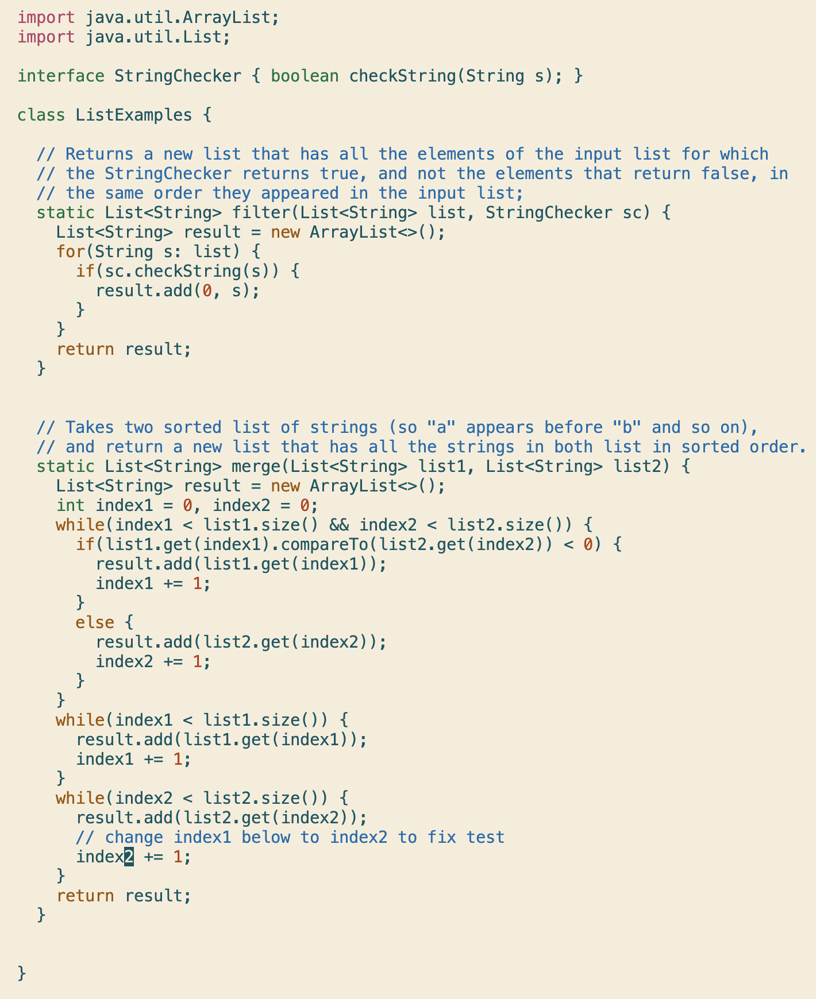
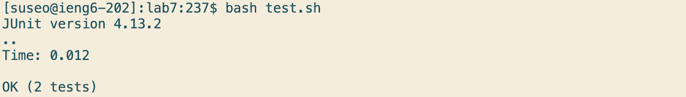
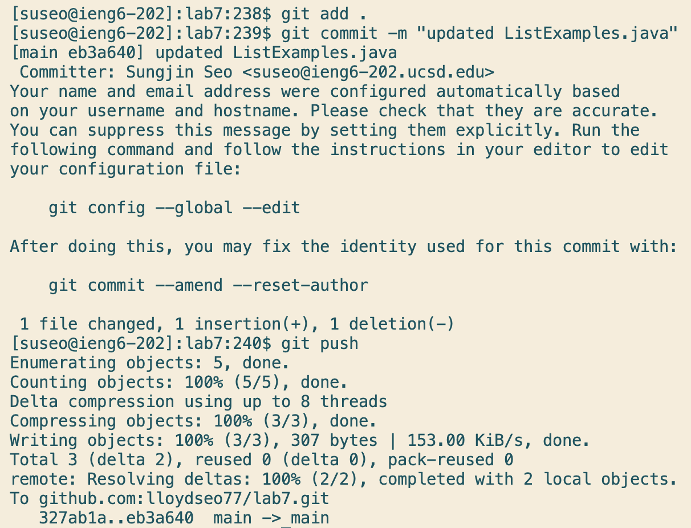

> Step 4


Keys pressed: ```ssh suseo@ieng6.ucsd.edu <enter>``` 
```ssh``` lets me log in to ```ieng6```.

> Step 5


Keys pressed: ```git clone git@github.com:lloydseo77/lab7.git <enter>```
```git clone``` allows me to clone the fork of the repository.

> Step 6


Keys pressed: ```cd lab7 <enter>``` -> ```javac ListExamples.java <enter>``` -> ```bash test.sh <enter>``` 
I had to change directory to lab7 after cloning the repository so I did ```cd lab7```. Then I compiled the ```ListExamples.java``` file to run tests. Then I did ```bash test.sh```

> Step 7


Keys pressed: ```vim ListExamples.java <enter>``` -> ```43j e r2 :wq <enter>```
I did ```vim ListExamples.java``` to start editing the java file. Then I did ```43j``` to go down to line 43, ```e``` to get to the end of the first word, ```r2``` to change the character the cursor is on the 2, then ```:wq``` to save the file and exit vim. 

> Step 8


Keys pressed: ```bash test.sh <enter>```
```bash test.sh``` to run the bash script again to run the tests.

> Step 9


Keys pressed: ```git add. <enter>``` -> ```git commit -m "updated ListExamples.java" <enter>``` -> ```git push <enter>```
I ran the first command to stage changes in the working directory, the second to commit staged changes with a commit message, and the last command to push commited changes from the local repository to a remote repository.
