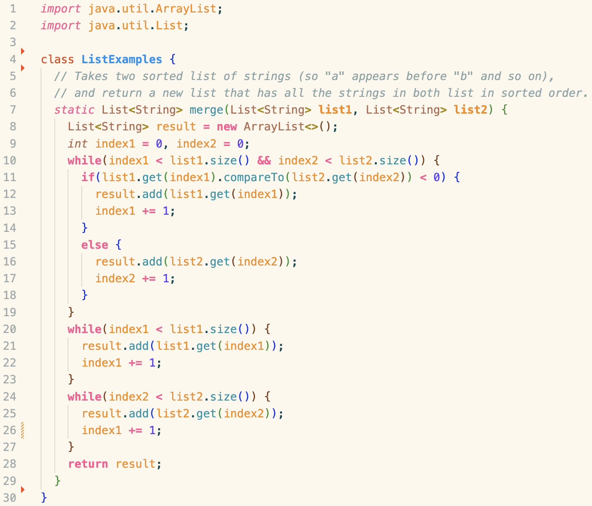
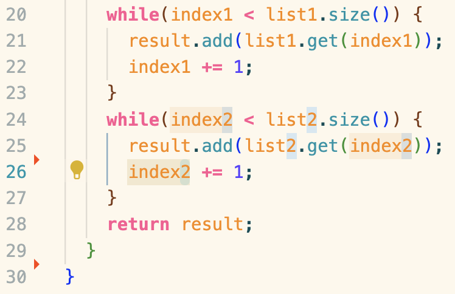

Student: This is a screenshot of the code. Running the tests on the code, I'm getting a "test timed out" error so I'm guessing there is an infinite loop somewhere in my program.

TA: One or more while loop blocks are causing an infinite loop. Can you trace through your loops to figure out which one is causing it?



Student: I traced through my code and realized that I was incrementing ```index1``` in the last loop, which was iterating through ```list2```.

**Setup**
<b/>
A folder with ```ListExamples.java```, ```ListExamplesTests.java```, and ```test.sh```

```ListExamples.java``` Code:
```
import java.util.ArrayList;
import java.util.List;

class ListExamples {
  // Takes two sorted list of strings (so "a" appears before "b" and so on),
  // and return a new list that has all the strings in both list in sorted order.
  static List<String> merge(List<String> list1, List<String> list2) {
    List<String> result = new ArrayList<>();
    int index1 = 0, index2 = 0;
    while(index1 < list1.size() && index2 < list2.size()) {
      if(list1.get(index1).compareTo(list2.get(index2)) < 0) {
        result.add(list1.get(index1));
        index1 += 1;
      }
      else {
        result.add(list2.get(index2));
        index2 += 1;
      }
    }
    while(index1 < list1.size()) {
      result.add(list1.get(index1));
      index1 += 1;
    }
    while(index2 < list2.size()) {
      result.add(list2.get(index2));
      index1 += 1;
    }
    return result;
  }
}
```

```ListExamplesTests.java``` Code:
```
import static org.junit.Assert.*;
import org.junit.*;
import java.util.*;
import java.util.ArrayList;


public class ListExamplesTests {
	@Test(timeout = 500)
	public void testMerge1() {
    		List<String> l1 = new ArrayList<String>(Arrays.asList("x", "y"));
		List<String> l2 = new ArrayList<String>(Arrays.asList("a", "b"));
		assertArrayEquals(new String[]{ "a", "b", "x", "y"}, ListExamples.merge(l1, l2).toArray());
	}
	
	@Test(timeout = 500)
        public void testMerge2() {
		List<String> l1 = new ArrayList<String>(Arrays.asList("a", "b", "c"));
		List<String> l2 = new ArrayList<String>(Arrays.asList("c", "d", "e"));
		assertArrayEquals(new String[]{ "a", "b", "c", "c", "d", "e" }, ListExamples.merge(l1, l2).toArray());
        }

}
```

```test.sh``` Code:
```
javac -cp .:lib/hamcrest-core-1.3.jar:lib/junit-4.13.2.jar *.java
java -cp .:lib/hamcrest-core-1.3.jar:lib/junit-4.13.2.jar org.junit.runner.JUnitCore ListExamplesTests
```

Command line to cause bug: ```bash test.sh```

How to fix bug: Edit incrementing line in last while loop (line 26) from ```index1``` to ```index2```

Reflection: One thing I enjoyed learning from my labs was figuring out how to use Vim. I think it is one of the most useful tools for a software developer, as it lets you edit files directly from the command line.
